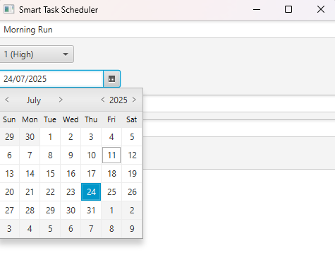

# Smart Task Scheduler

A JavaFX application to manage tasks with priorities and deadlines, featuring reminders and task persistence.

## Features

- **Add Tasks:** Create tasks with a title, priority level (High, Medium, Low), and deadline (date and time).
- **Task Prioritization:** Tasks are managed based on priority for efficient scheduling.
- **Task List View:** View all tasks in a clean, scrollable list with clear formatting.
- **Task Reminders:** Get timely reminders for tasks at their deadlines (currently via console output).
- **Persistent Storage:** Tasks are saved to and loaded from JSON files to maintain data between sessions.
- **Custom Styling:** Clean and modern UI enhanced with CSS styling.
- **User-friendly Input:** Input fields include prompts and default values for easier data entry.
- **Flexible Time Selection:** DatePicker plus separate hour and minute fields for precise deadline setting.
- **Graceful Shutdown:** Saves all tasks automatically on exit to prevent data loss.
- **Expandable Architecture:** Modular design with separate classes for task management, reminders, and file handling—easy to extend with features like notifications or task editing.
- **Error Handling:** Basic validation to ensure tasks have titles and valid deadlines before adding.
- **Cross-Platform:** Runs on any OS supporting Java 17+ and JavaFX.
- **Open Source Friendly:** Easily customizable and extendable for your own task scheduling needs.

## Screenshots

### Adding a New Task



### Reminder Console Output


> **Note:** Screenshots are for illustration; update paths with your actual images.

## Requirements

- Java 17 or later
- JavaFX SDK 17 or later
- Gson library (for JSON serialization)
- Compatible OS (Windows, macOS, Linux)

## Setup & Running

### 1. Clone the repository

```bash
git clone <repository-url>
cd SmartTaskScheduler

```
### Compile And Run
```bash
javac --module-path "path_to_javafx_lib" --add-modules javafx.controls,javafx.fxml -cp "lib/gson-2.10.1.jar" -d bin src/**/*.java
java --module-path "path_to_javafx_lib" --add-modules javafx.controls,javafx.fxml -cp "bin;lib/gson-2.10.1.jar" TaskApp

