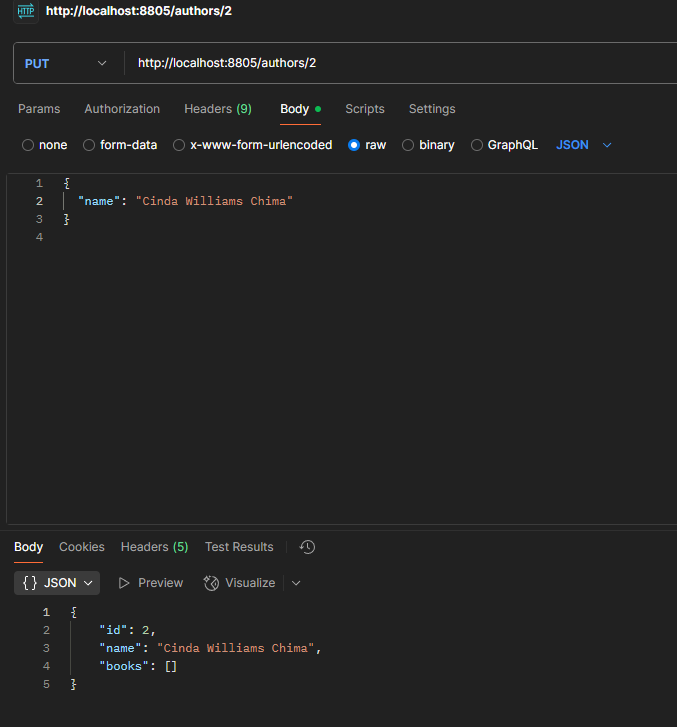

# Bookstore API

A simple RESTful API built with Spring Boot for managing Books and Authors, using an in-memory H2 database.

---

## Features

- **CRUD operations for Authors**  
  - Create, read, update, and delete authors  
  - View all authors or fetch by ID

- **CRUD operations for Books**  
  - Create, read, update, and delete books  
  - Pagination and sorting support for listing books  
  - Associate books with authors  
  - Update book's author separately

- **In-memory H2 database**  
  - Auto schema generation and updates  
  - H2 console for database inspection

- **Error handling**  
  - Proper HTTP status codes for resource not found  
  - Basic runtime exceptions for invalid IDs

- **Logging**  
  - SQL queries output to console for debugging

---

## Tools & Technologies

- Java 17+  
- Spring Boot 3.x  
- Spring Data JPA  
- H2 Database (in-memory)  
- Maven or Gradle (build tool)  
- Postman (API testing)  
- IDE (IntelliJ IDEA, Eclipse, VSCode, etc.)

---

## Getting Started

### Prerequisites

- Java JDK 17 or higher installed  
- Maven or Gradle installed  
- Postman installed (optional, for testing)  
- Git installed (optional)

### Clone the repository

```bash
git clone <repository-url>
cd bookstore
```

### Build and run the application

Using Maven:

```bash
mvn clean install
mvn spring-boot:run
```

Or using Gradle:

```bash
./gradlew clean build
./gradlew bootRun
```

The app will start on port `8805`.

---

## Configuration

Application settings are in `src/main/resources/application.properties`:

```properties
# Enable H2 web console
spring.h2.console.enabled=true
spring.h2.console.path=/h2-console

# H2 database URL and credentials
spring.datasource.url=jdbc:h2:mem:bookstoredb;DB_CLOSE_DELAY=-1;DATABASE_TO_UPPER=false
spring.datasource.driver-class-name=org.h2.Driver
spring.datasource.username=sa
spring.datasource.password=

# Hibernate auto schema update
spring.jpa.hibernate.ddl-auto=update

# Show SQL queries in console
spring.jpa.show-sql=true

# Custom server port
server.port=8805
```

---

## API Endpoints

### Authors

| Method | Endpoint          | Description           |
| ------ | ----------------- | --------------------- |
| GET    | `/authors`        | Get all authors       |
| POST   | `/authors`        | Create a new author   |
| GET    | `/authors/{id}`   | Get author by ID      |
| PUT    | `/authors/{id}`   | Update author by ID   |
| DELETE | `/authors/{id}`   | Delete author by ID   |

### Books

| Method | Endpoint               | Description               |
| ------ | ---------------------- | ------------------------- |
| GET    | `/books`               | Get paginated list of books (with sorting) |
| POST   | `/books`               | Create a new book         |
| GET    | `/books/{id}`          | Get book by ID            |
| PUT    | `/books/{id}`          | Update book by ID         |
| POST   | `/books/{id}/author`   | Update author of a book   |
| DELETE | `/books/{id}`          | Delete book by ID         |

---

## Testing with Postman

### 1. update Author



### 2. Create Book


### 3. Fetch Data from H2 Console


---

## H2 Database Console

- URL: `http://localhost:8805/h2-console`  
- JDBC URL: `jdbc:h2:mem:bookstoredb`  
- User: `sa`  
- Password: *(leave blank)*

Use SQL commands such as:

```sql
SHOW TABLES;
SELECT * FROM author;
SELECT * FROM book;
```

---

## Notes

- The `year` field in `Book` is mapped to `publication_year` in the database to avoid reserved keyword conflicts.  
- Application logs SQL queries for debugging.  
- API responses use proper HTTP status codes.  
- For production, replace H2 with a persistent database like MySQL or PostgreSQL.

---

## Future Improvements

- Add request validation and error handling with `@ControllerAdvice`  
- Add DTOs to separate entity and API model layers  
- Add Swagger/OpenAPI documentation  
- Implement authentication and authorization  
- Add unit and integration tests

---

## Contact

For questions or suggestions, contact Ankur Gupta at guptaankur271@gmail.com

---

*Happy coding!* 🚀
